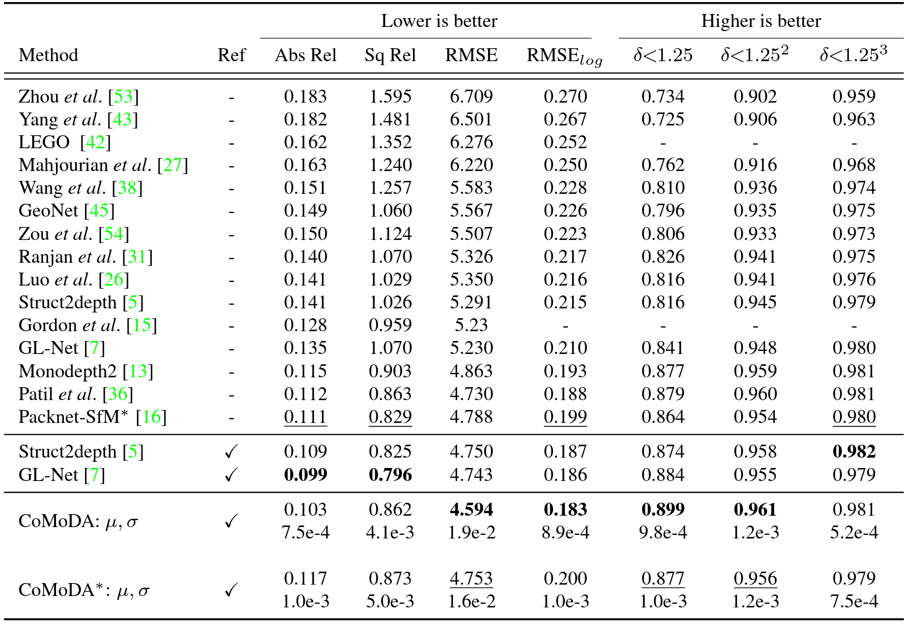

# CoMoDA: Continuous Monocular Depth Adaptation Using Past Experiences

Official pytorch repository for the depth adaptation method described in  
[**CoMoDA: Continuous Monocular Depth Adaptation Using Past Experiences**](https://openaccess.thecvf.com/content/WACV2021/papers/Kuznietsov_CoMoDA_Continuous_Monocular_Depth_Adaptation_Using_Past_Experiences_WACV_2021_paper.pdf)  
By Yevhen Kuznietsov, Marc Proesmans and Luc Van Gool at ESAT-PSI, KU Leuven


## Environment setup 

The main prerequisites are python 3 and pytorch 1.3 or compatible.  
For conda users run: 
```shell
conda create --name <env_name> --file  requirements.txt
```

The code might work with other package versions as well.


## Data preparation

The method expects the following data format:

```
|-- <data_path>
    |-- <sequence_1>  
        |-- %10d.png  
        |-- %10d_kin.txt  
        |-- %10d_<segsuffix>.png  
    
    ...  
    |-- <sequence_n>
```
Where `<data_path>` is the root directory for the data;

`<sequence>` is a name of the sequence / scene as in [test_scenes.txt](./code/utils/test_scenes.txt);  

`%10d.png` is a triplet of consecutive sequence frames stitched horizontally. The  triplet index corresponds to the index of the central frame of the triplet;  

`%10d_kin.txt` is a text file containing 4 values: velocity at the previous frame, time between the previous and the current frames, 
velocity at the current frame, time between the current and the next frame. It is possible to tun the adaptation without velocity supervision;  

`%10d_<segsuffix>.png` is a triplet of binary masks for possibly moving objects corresponding to respective RGB triplet. 
These masks can be generated using either off-the-shelf semantic segmentation or object detection models (bounding box lvl is enough).
We tested the bounding boxes generated by [Mask-RCNN](https://pytorch.org/tutorials/intermediate/torchvision_tutorial.html) and so called [YOLOv5m](https://github.com/ultralytics/yolov5). 
It is possible to run the adaptation without semantic information.


The script for preparing the data is going to be be uploaded soon.


## Running the method

Due to the licensing issues, running CoMoDA is currently a bit tricky. We hope to resolve them in the nearest future.

Folow these steps:
1. These third party modules must be made available: [layers](https://github.com/nianticlabs/monodepth2/blob/master/layers.py) and [networks](https://github.com/nianticlabs/monodepth2/tree/master/networks) (the implementation of the latter may vary, e.g. if a different architecture is used);
2. Download the pre-trained depth estimation model (e.g., Monodepth2). In future, we might provide the weights for the pre-trained scale-aware modification of Monodepth2 from the paper;
3. Run 
```shell
python CoMoDA.py --data_path <data_root_dir> --seq_file <seq_file> --seq_dir <seq_dir> --buf_path <buf_path> --log_dir <log_dir> --load_weights_folder <path_to_pretrained_model> --png
```

Where `<seq_file>` is the path to the file containing the list of videos or sequences adaptation was performed on (e.g., [test_scenes.txt](./code/utils/test_scenes.txt));  

`<seq_dir>`  is a dir, which contains a file with the ordered frame list for every adapted sequence or video (e.g., [test_seqs](./code/utils/test_seqs)); 

`<buf_path>`  is the path to the file with the pre-generated list of samples for experience replay (e.g., [rb_1234.txt](./code/utils/rb_1234.txt));  

`<log_dir>` is the dir to write logs, the predictions will be saved to `<log_dir>/preds`. 

The core of the method is model-agnostic, so the code can be modified for adapting any reasonable depth estimation model.

## Evaluation on Eigen split of KITTI

1. Run
```shell
python seqpred2eigen.py <sequence_list_file> <predictions_dir> <output_file_path>
``` 
&nbsp;&nbsp;to generate inverse depths for Eigen test set.  

&nbsp;&nbsp;Where `<sequence_list_file>` is the path to the file containing the list of videos or sequences adaptation was performed on (e.g., [test_scenes.txt](./code/utils/test_scenes.txt));

&nbsp;&nbsp;`<predictions_dir>`  is the directory with the predictions produced by the method;  

&nbsp;&nbsp;`<output_file_path>` is the desired path and file name for depth predictions compatible with Eigen test set (e.g., "eigen.npz"). 

2. Run the [evaluation script from Monodepth2](https://github.com/nianticlabs/monodepth2/blob/master/evaluate_depth.py) with the file from the previous step or [eigen.npz](./eigen.npz) as an input


## Results on Eigen split of KITTI

The numbers for CoMoDA were obtained using ResNet18 backbone and image resolution of 640x192 px.



\* means that no median rescaling is applied. Ref indicates if any kind of test-time model updates are performed.

## Citation

If you find the depth adaptation method useful, please consider citing:

    @InProceedings{comoda,
    author    = {Kuznietsov, Yevhen and Proesmans, Marc and Van Gool, Luc},
    title     = {CoMoDA: Continuous Monocular Depth Adaptation Using Past Experiences},
    booktitle = {Proceedings of the IEEE/CVF Winter Conference on Applications of Computer Vision (WACV)},
    month     = {January},
    year      = {2021},
    pages     = {2907-2917}
    }
    
## License

This work is licensed under the Creative Commons Attribution-NonCommercial 4.0 International [License](./LICENSE).

## Acknowledgements

This work was supported by Toyota, and was carried out at the TRACE Lab at KU Leuven (Toyota Research on Automated Cars in Europe - Leuven).
